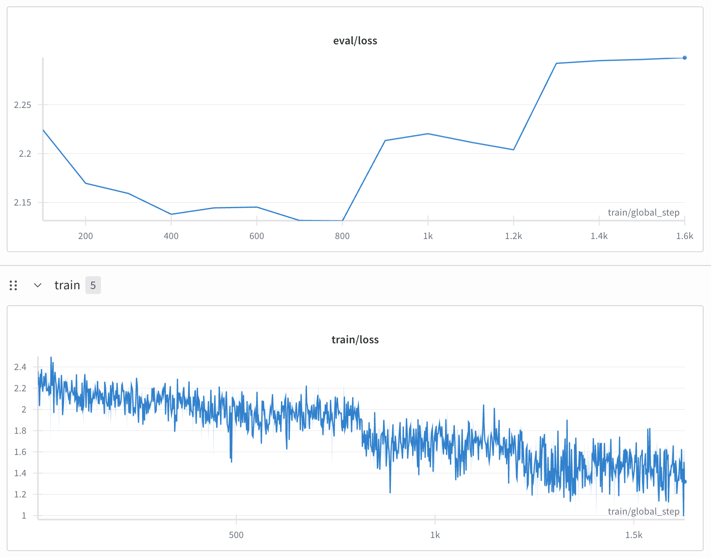

# Nik.art Style Blog Post Generator

This project fine-tunes Llama 3.1 70B to generate blog posts in the distinctive style of [nik.art](https://nik.art/). The model learns to mimic the author's writing patterns, tone, and content structure through supervised fine-tuning.

## Project Overview

**Objective**: Create an AI model that can generate blog posts matching the style and quality of nik.art content.

**Approach**: 
- Fine-tune Llama 3.1 70B on historical blog posts (2024 and earlier)
- Evaluate performance on 2025 posts to test generalization
- Use Claude for quality assessment and checkpoint comparison

**Key Results**: Successfully generated coherent blog posts that capture the author's distinctive voice and philosophical style.

## Technical Details

### Model & Framework
- **Base Model**: Llama 3.1 70B
- **Fine-tuning**: LoRA (Low-Rank Adaptation) with 4-bit quantization
- **Framework**: Unsloth (switched from FSDP due to memory efficiency)
- **Training Infrastructure**:
   - FSDP: Two instances, each with one A10G GPU (24GB VRAM)
   - Unsloth: Single instance with H100 GPU (80GB VRAM)
### Data Pipeline
1. **Data Collection**: Web scraping of all nik.art blog posts
2. **Data Splitting**: 
   - Training: Posts through December 2024
   - Validation: Posts from January 2025 onward
3. **Format**: Title + content structure with special tokens

### Evaluation Methodology
- Generated posts from two checkpoints:
   - Epoch 800: Lowest eval loss
   - Epoch 1628: The model is overfitted to training data
- Used Claude to evaluate for coherence and style matching
- Comparative selection between checkpoints for optimal results

<div align="center">
  
  <p><em>Train and evaluation loss</em></p>
</div>

## Project Structure

```
nik_llama/
├── data/                           # Data collection and preprocessing
│   ├── scraper.ipynb              # Web scraping notebook
│   ├── all_posts.json             # Raw scraped blog posts
│   ├── training_data_before_2025.jsonl
│   ├── val_data_2025_onward.jsonl
│   └── requirements.txt
├── fsdp/                          # Initial FSDP approach
│   └── configs/
├── unsloth/                       # Main training and inference
│   ├── train.py                   # Fine-tuning script
│   ├── inference.py               # Generation script
│   ├── output_review.py           # Claude evaluation script
│   ├── synthesize_result.ipynb    # Results processing
│   ├── comparison.html            # Final results visualization
│   ├── outputs/                   # Generated content and evaluations
│   └── requirements.txt
└── README.md
```

## Setup and Installation

### Prerequisites
- Python 3.8+
- CUDA-compatible GPU(s) with sufficient VRAM
- HuggingFace account and API key
- Anthropic API key (for evaluation)
- WandB account (for training monitoring)

### Environment Setup

1. **Clone the repository**:
   ```bash
   git clone https://github.com/duc-ph/nik-llama.git
   cd nik-llama
   ```

2. **Install dependencies**:
   ```bash
   # For data collection
   cd data
   pip install -r requirements.txt

   # For training and inference
   cd ../unsloth
   pip install -r requirements.txt
   ```

3. **Configure environment variables**:
   ```bash
   # Copy the example environment file and configure
   cd unsloth
   cp .env.example .env
   # Edit .env with your actual API keys and configuration
   ```

## Usage

### 1. Data Collection
```bash
cd data
jupyter notebook scraper.ipynb
# Follow notebook cells to scrape nik.art and create training data
```

### 2. Model Training

#### Option A: Unsloth Training (Recommended)
```bash
cd unsloth
python train.py
```

#### Option B: FSDP Training with Axolotl (Multi-GPU)
For training on multiple GPUs using FSDP + QLoRA:

```bash
# Install axolotl
pip install axolotl[flash-attn,deepspeed]

# Configure accelerate for multi-machine FSDP
accelerate config
# Use the settings from fsdp/configs/accelerate_config.yaml as reference

# Run training with axolotl
cd fsdp
accelerate launch -m axolotl.cli.train configs/llama-3.1-8b.yml
```

**Configuration files in `fsdp/configs/`**:
  - `accelerate_config.yaml`: Multi-machine accelerate configuration
  - `llama-3.1-8b.yml`: Axolotl training configuration with FSDP + QLoRA

I encountered OOM issues with FSDP even on 2x24GB GPUs when training the 4-bit 8B model, therefore I switched to Unsloth for better memory efficiency.

### 3. Inference and Generation
```bash
# Generate posts from a specific checkpoint
python inference.py ./outputs/checkpoint-800 ../data/val_data_2025_onward.jsonl ./outputs/checkpoint-800-generation.jsonl

python inference.py ./outputs/checkpoint-1628 ../data/val_data_2025_onward.jsonl ./outputs/checkpoint-1628-generation.jsonl
```

### 4. Quality Evaluation
```bash
# Evaluate generations with Claude
python output_review.py ./outputs/checkpoint-800-generation.jsonl ./outputs/checkpoint-800-generation-ok.jsonl

python output_review.py ./outputs/checkpoint-1628-generation.jsonl ./outputs/checkpoint-1628-generation-ok.jsonl
```

### 5. Results Synthesis
```bash
cd unsloth
jupyter notebook synthesize_result.ipynb
# Process evaluations and create final comparison.html
```

## Key Features

- **Memory-Efficient Training**: Uses Unsloth for optimized memory usage during fine-tuning
- **Automated Quality Control**: Claude evaluation ensures generated content meets quality standards
- **Checkpoint Comparison**: Systematic evaluation of multiple training checkpoints
- **Interactive Results**: HTML visualization for easy comparison of original vs generated content

## Results

The fine-tuned model successfully generates blog posts that:
- Maintain the philosophical and reflective tone of nik.art
- Follow similar structural patterns (short, impactful paragraphs)
- Demonstrate coherent reasoning and meaningful insights
- Avoid common language model pitfalls (repetition, hallucination)

View the complete results in `unsloth/comparison.html`.

## License

This project is for educational and research purposes. Please respect the original content creator's work and the terms of service of the source website.